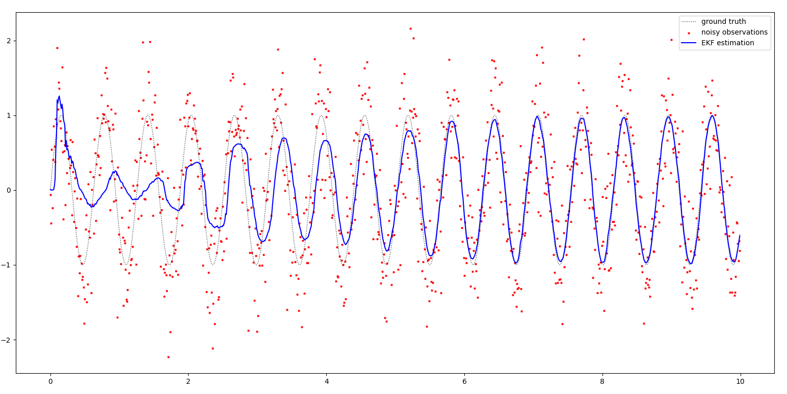

# AutoDiffEKF
Extended Kalman Filter with automatic differentiation of the dynamic (predict) and measurement model (update) functions.

## Example
Parameter identification of a sine function of the form `a * sin(w * t + phi)` from noisy observations.

## Dependencies
- Eigen3
- autodiff
- pybind11 (plotting)
- matplotlibcpp17 (plotting)
